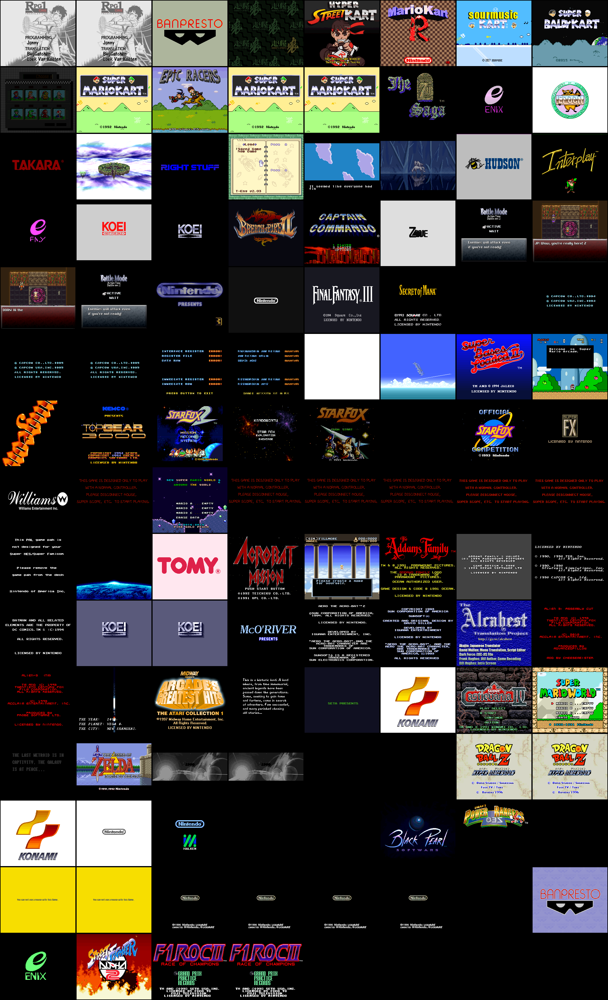

<!-- markdownlint-disable MD033 MD041 -->
<div align="center">

# RustySNES

**A cycle-accurate Super Nintendo / Super Famicom emulator in Rust.**

</div>

<p align="center">
  <a href="https://github.com/doublegate/RustySNES/actions"></a> <a href="#license"></a> <a href="rust-toolchain.toml"></a><br>
  <a href="https://doublegate.github.io/RustySNES/"></a><br>
  <a href="#platform-support"></a>
</p>

## Overview

**RustySNES is a cycle-accurate Super Nintendo Entertainment System (SNES) emulator written in
pure Rust.** Following the lineage of its predecessor
[`RustyNES`](https://github.com/doublegate/RustyNES), it targets the Mesen2 / higan / ares
accuracy bar — a master-clock lockstep scheduler, a strictly-owned bus, and a deterministic audio
resync model.

Beyond reference accuracy, RustySNES is a real, playable emulation platform today: a native
desktop shell (winit + wgpu + cpal + egui) boots real commercial ROMs with picture, sound, and
control, alongside 11 cartridge coprocessors, save states with a thumbnail multi-slot manager,
rewind, run-ahead, a Lua scripting/TAS engine, Game Genie/Pro Action Replay cheats, GGPO-style
rollback netplay, RetroAchievements, and a live in-browser WebAssembly build. See
[`to-dos/VERSION-PLAN.md`](to-dos/VERSION-PLAN.md) for the named, versioned release ladder from
`v1.0.0` "Zenith" (the production cut) onward.

---

## Why RustySNES?

RustySNES combines **accuracy-first emulation** with the **safety guarantees of Rust**, and is
building toward the same modern-feature breadth as its sibling project
[`RustyNES`](https://github.com/doublegate/RustyNES).

**Key differentiators:**

- **Reference-grade accuracy** — a from-scratch core on a 21.477 MHz NTSC master clock with a
  lockstep scheduler for every chip. The 5A22 CPU's variable-cycle (6/8/12) instruction timings
  and dot-accurate PPU/HDMA behavior are cycle-exact, not approximated: the 65C816 and SPC700 both
  clear their per-opcode oracles at 0-diff.
- **Determinism as a hard contract** — the asynchronous SPC700/S-DSP audio processor is kept
  perfectly coherent with the main CPU through an integer relative-time accumulator, with no
  floating point in the timing path. The same seed, ROM, and input sequence yield a bit-identical
  framebuffer and audio output — the foundation save states, rewind, run-ahead, and rollback
  netplay all build on.
- **Honest accuracy tiering** — every coprocessor/board is tiered Core / Curated / BestEffort (see
  [`docs/adr/0003`](docs/adr/0003-accuracy-tiering-honesty-gate.md)); a CI honesty gate ensures no
  unverified BestEffort board ever backs the accuracy oracle. Nothing is silently degraded, and
  every known gap (a coprocessor boot issue, an unwired peripheral, an incomplete opt-in feature)
  is documented rather than hidden.
- **Safe, modular Rust** — the chip stack is `no_std + alloc` with a one-directional workspace
  graph, making each component independently testable, fuzzable, and benchmarkable.

---

## Feature highlights

| Feature | Description |
| --- | --- |
| **Cycle-Accurate Core** | 65C816 + SPC700 both 0-diff vs. their SingleStepTests per-opcode oracles; a master-clock lockstep scheduler; dot-accurate PPU/HDMA/interrupts |
| **11 Coprocessors** | DSP-1, Super FX/GSU, SA-1 (Core/Curated, oracle-gated); DSP-2, DSP-4, ST010, CX4, OBC1, S-DD1 (BestEffort, real-title validated); ST018, S-RTC (BestEffort, unit-tested); SPC7110 (implemented — the local dump is a ROM-sourcing gap, not an open bug) |
| **Native Desktop Frontend** | `winit` + `wgpu` + `cpal` + `egui`; keyboard + gamepad input, drag-and-drop/zip-archived ROM loading, automatic coprocessor-firmware + `.srm` SRAM loading |
| **WebAssembly Build** | The SAME `App`/egui shell as native (`wasm-winit`), deployed live at the hosted demo, plus a lighter canvas-2D fallback (`wasm-canvas`) |
| **Save States** | A quick-save slot plus a disk-backed, thumbnail-previewed **10-slot manager**, keyed per-ROM by SHA-256, on a versioned deterministic snapshot envelope |
| **Rewind / Run-Ahead** | A bounded ring buffer of full snapshots + an N-frame peek-and-discard run-ahead, both config-driven and off by default |
| **Peripherals** | Mouse / Super Scope / Super Multitap — the real 2-bit-per-clock serial-shift-register protocol, ported from ares, not a stub |
| **Lua Scripting + TAS** | A sandboxed Lua 5.4 (`mlua`) engine with WRAM read/write + per-frame callbacks, and a deterministic TAS movie record/playback format |
| **Cheats** | Game Genie / Pro Action Replay codes, applied as a `Bus` read intercept (not a WRAM poke, since real codes target cartridge ROM) |
| **Rollback Netplay** | GGPO-style 2-player rollback over native UDP, proven bit-identical resimulation under adverse network conditions; a WebRTC transport exists at the crate level |
| **RetroAchievements** | A native FFI bridge around the vendored `rcheevos` `rc_client` C API — login, achievements, and unlock toasts |
| **Desktop UX Shell** | Light/dark/system themes, 25%-300% speed presets, fullscreen, a key-rebind grid, a Performance panel (FPS/frame-time/audio-health + a rolling sparkline), and a first-run welcome modal |
| **Debugger Overlay** | Live CPU/PPU/APU/cart panels, read/write watchpoints, a 65C816 disassembler + PC breakpoints/step controls |
| **Pure Rust** | `no_std + alloc` chip stack; a one-directional crate graph so each chip is independently fuzzable/benchmarkable |

Legend for the accuracy tiers: **Core/Curated** = cross-checked against an independent reference
oracle; **BestEffort, real-title validated** = boots a real commercial title to gameplay content;
**BestEffort, unit-tested** = no commercial dump in the local corpus yet. See
[`docs/STATUS.md`](docs/STATUS.md) for the always-current per-subsystem detail and
[`to-dos/VERSION-PLAN.md`](to-dos/VERSION-PLAN.md) for exactly which release each remaining item
lands in.

---

## Crates & Architecture

The workspace strictly enforces a one-directional dependency graph to isolate emulation systems
from one another, connected only through the core bus.

| Crate | Role |
| --- | --- |
| `rustysnes-cpu` | WDC 65C816 (Ricoh 5A22) |
| `rustysnes-ppu` | PPU1 (5C77) + PPU2 (5C78) |
| `rustysnes-apu` | SPC700 + S-DSP |
| `rustysnes-cart` | LoROM/HiROM/ExHiROM + all 11 coprocessor implementations |
| `rustysnes-core` | The Bus + master-clock scheduler tie crate, including peripherals (mouse/scope/multitap) |
| `rustysnes-savestate` | The versioned save-state envelope shared by every board + chip |
| `rustysnes-frontend` | The `winit + wgpu + cpal + egui` desktop/web shell (binary `rustysnes`) |
| `rustysnes-netplay` | GGPO-style rollback netcode (native UDP + a WebRTC transport) |
| `rustysnes-cheevos` | RetroAchievements `rcheevos` FFI bridge (opt-in, native-only) |
| `rustysnes-script` | Sandboxed Lua 5.4 scripting engine + TAS movie format (opt-in, native-only) |
| `rustysnes-test-harness` | The accuracy oracle (SingleStepTests runners, golden-log suites, per-coprocessor commercial-ROM validation, boot-screenshot generation) |

Three load-bearing architectural decisions, detailed in
[`docs/architecture.md`](docs/architecture.md):

1. **A shared master-clock timebase.** Every chip advances off the same 21.477 MHz master clock
   in lockstep, so mid-instruction PPU/HDMA events work without per-quirk patches.
2. **The Bus owns everything mutable.** `rustysnes-core::Bus` holds the PPU, APU, cart, and
   controller state; the CPU borrows `&mut Bus` during execution.
3. **A one-directional workspace graph.** No chip crate depends on another; `rustysnes-core` ties
   them together, so each chip is independently fuzzable and benchmarkable.

See [`docs/DOCUMENTATION_INDEX.md`](docs/DOCUMENTATION_INDEX.md) for the full documentation map
(subsystem specs, ADRs, testing strategy, and more).

---

## Quick Start

### Build from source

**Prerequisites:**

- **Rust 1.96** — pinned via `rust-toolchain.toml` and auto-installed by
  [rustup](https://rustup.rs).
- **Linux desktop dependencies** for `winit` / `wgpu` / `cpal` / `egui` (see below).
- **Git.**

```bash
# Clone the repository
git clone https://github.com/doublegate/RustySNES.git
cd RustySNES

# Build the workspace (release)
cargo build --release --workspace

# Run a ROM you legally own
cargo run --release -p rustysnes-frontend -- path/to/rom.sfc

# Optional: build with one feature (e.g. RetroAchievements)
cargo run --release -p rustysnes-frontend --features retroachievements -- path/to/rom.sfc

# Maximal NATIVE build — every opt-in feature at once (debug-hooks, scripting,
# cheats, netplay, retroachievements, hd-pack). Aliases make it a one-liner:
cargo full-run path/to/rom.sfc   # run the most fully-featured desktop binary
cargo full-build                 # build it (= --release -p rustysnes-frontend --features full)
```

The `full` build is purely additive — the default/shipped build and the emulation core are
unchanged. `emu-thread` (a dedicated emulation thread) is deliberately excluded from `full`: it
isn't feature-complete yet (no audio output, and it doesn't yet drive cheats/scripting/rewind —
see `docs/frontend.md`).

The frontend opens a window (scaled, aspect-correct), starts audio via the OS default device, and
runs the ROM. With no ROM path, it opens straight to the menu shell (File → Open ROM…).

#### Command-line help

The native binary ships a clap 4 CLI with styled `--help`, a `help` subcommand, shell completions,
and (on a terminal) an interactive help browser:

```bash
rustysnes --help                 # styled usage + examples + keyboard summary
rustysnes help                   # browse all topics (interactive TUI on a terminal)
rustysnes help coprocessors      # one topic, printed (also works piped: `… | less`)
rustysnes completions fish       # print a shell-completion script
```

Help topics: `controls`, `hotkeys`, `gamepad`, `features`, `coprocessors`, `config`, `scripting`,
`netplay`, `about`. The interactive browser is behind the default-on `help-tui` cargo feature;
piped/non-terminal output falls back to a static page.

### Platform-specific dependencies

**Ubuntu / Debian:**

```bash
sudo apt-get install -y libxkbcommon-dev libwayland-dev libxkbcommon-x11-dev libasound2-dev libudev-dev
```

**CachyOS / Arch:**

```bash
sudo pacman -S --needed libxkbcommon wayland alsa-lib systemd-libs
```

**macOS / Windows:** no extra system dependencies are required for the default build. The
optional `retroachievements` and `scripting` features additionally need a C compiler for their
vendored C sources (`rcheevos`, `mlua`'s Lua 5.4).

### Run in the browser (WebAssembly)

A hosted demo is deployed automatically on every push to `main`, live at
**[doublegate.github.io/RustySNES](https://doublegate.github.io/RustySNES/)**. To build it
yourself you need [trunk](https://trunkrs.dev) (`cargo install trunk`):

```bash
cd crates/rustysnes-frontend/web
trunk serve            # dev server
trunk build --release  # the full winit + wgpu + egui build in ./dist
# Or a lightweight canvas-2D embed:
trunk build --release --no-default-features --features wasm-canvas
```

---

## Desktop UX

The desktop frontend frames the SNES image with an always-on **menu bar** (top) and **status
bar** (bottom); the egui debugger is a separate overlay (behind the `debug-hooks` feature).
Everything is reachable from the menu bar, and also from **global keyboard hotkeys** (`v1.0.1`):
`Escape`=Quit, `F1`=Save State, `F2`=Reset, `F3`=Power Cycle, `F4`=Load State, `F5`=Rewind,
`F9`=Save States… window, `F11`=Fullscreen, `F12`=Open ROM, `Space`=Pause/Resume, `` ` ``=Toggle
Debugger overlay (feature-gated: `debug-hooks`) — see `rustysnes help hotkeys`.

- **Menu bar** — File (Open ROM, Close ROM, Settings, Quit), Emulation (Pause/Resume, Reset, Power
  Cycle, Save/Load State (quick slot), Rewind, **Save States…** (10-slot thumbnail manager),
  Region, **Speed** 25%–300% presets), Tools (Cheats / Netplay / RetroAchievements windows, each
  feature-gated), View (Integer scale, **Performance panel**, **Fullscreen**), Debug (the debugger
  overlay, feature-gated).
- **Settings window** — a tabbed Video / Audio / Input / System dialog: present-mode radio,
  volume slider, **8 per-voice mute checkboxes** (`v1.0.1`, a frontend/debug convenience — real
  S-DSP hardware has no per-voice mute register), a per-button **key-rebind grid** (click "Rebind",
  press the new key — Esc cancels), controller port 2 peripheral selection, region, and
  **light/dark/system theme**.
- **Performance panel** — FPS, current speed, frame time, audio-ring health, and a rolling
  ~2-second frame-time sparkline — pure diagnostics, no controls.
- **First-run welcome modal** — a brief orientation shown once, the very first launch.

## Default Controls

Every P1 binding is rebindable in Settings → Input (persisted to `config.toml`). USB gamepads
auto-bind to P1 (Xbox-style: South = B, East = A, West = Y, North = X — the SNES diamond is
rotated relative to Xbox's).

| Action | Key |
| --- | --- |
| D-pad | Arrow keys |
| A / B | X / Z |
| X / Y | S / A |
| L / R | Q / W |
| Select / Start | Right Shift / Enter |

Run `rustysnes help controls` / `help gamepad` for the full reference.

---

## Compatibility and Accuracy

RustySNES doesn't have one monolithic all-in-one oracle ROM (the way RustyNES's AccuracyCoin
does for the NES) — no publicly available SNES ROM plays that role. Instead, accuracy is a
**composed multi-layer battery** across independently-sourced suites
([`docs/testing-strategy.md`](docs/testing-strategy.md)); each layer's own status is tracked
here, always current, reaffirmed every release:

| Layer | Result |
| --- | --- |
| CPU (65C816) per-opcode oracle | **0-diff** — 5,119,999 / 5,120,000 (the one residual is a documented inter-reference divergence, not a bug — [`docs/adr/0002`](docs/adr/0002-fractional-timebase-refactor.md)) |
| SPC700 per-opcode oracle | **0-diff, 100.00%** — 256,000 / 256,000 |
| On-cart CPU (gilyon `cputest-basic`) | **green** — 1107 / 1107 "Success" |
| PPU/DMA/HDMA golden framebuffer (undisbeliever) | **green, deterministic** — 29 / 29 ROMs bit-identical |
| Audio boot+run (blargg `spc_*`) | **literal PASS, all 4** — `spc_smp`, `spc_timer`, `spc_mem_access_times`, `spc_dsp6` |
| Core/Curated coprocessors (oracle-gated) | **3 / 3, honesty gate green** — DSP-1, Super FX/GSU, SA-1 |
| BestEffort coprocessors, real-title validated | **6 / 9** — DSP-2, DSP-4, ST010, S-DD1, CX4, OBC1 |
| BestEffort coprocessors, unit-test only | **3 / 9** — SPC7110 (ROM-sourcing gap, not a bug), ST018, S-RTC |
| Determinism contract | **proven** — bit-identical framebuffer/audio across runs; save-state round-trip proven across all three board tiers |

**Named residuals, tracked not hidden:** the 65816 `e1.e` inter-reference divergence; DSP-3 and
ST011 have no board wired yet; SPC7110's one locally available dump turned out to be a
fan-translation ROM hack, not an original cartridge (a correctly-sourced dump is the actual
remaining gap); PAL and ExLoROM both lack golden-ROM-boot proof (no ROM in the local corpus for
either); hi-res (Modes 5/6) output is implemented and unit-verified but has no real-title
validation yet. The full per-suite breakdown and the coprocessor coverage matrix live in
**[`docs/STATUS.md`](docs/STATUS.md)**.

**Everything shipped is additive and off-by-default** — every optional feature (`debug-hooks`,
`scripting`, `cheats`, `netplay`, `retroachievements`, `hd-pack`, `emu-thread`) is a frontend tap
or opt-in flag, so the default/native/`no_std`/wasm builds stay byte-identical when off.

> A note on test counts: RustySNES is validated by closed-form oracle ROMs (SingleStepTests,
> gilyon, undisbeliever, blargg) and per-coprocessor commercial-ROM suites, not by a headline unit
> test number alone (434 unit/integration tests run in `cargo test --workspace`, separate from the
> oracle suites above, which need `--features test-roms`). When a doc and a passing test ROM
> disagree, **the ROM wins** — that is this project's definition of "cycle-accurate."

---

## Performance

The headless core is comfortably real-time. Against the **16.64 ms NTSC frame deadline**:

| Workload | Frame time | Headroom |
| --- | --- | --- |
| `headless_frame_steady_state` (no-coprocessor ROM) | 3.27 ms | ~5.1× realtime |

A CI frame-time regression gate (`.github/workflows/ci.yml`'s `bench` job,
[`scripts/bench_regression_check.sh`](scripts/bench_regression_check.sh)) runs this benchmark on
every release-tag push and fails on a gross (~3×) regression against a 10 ms absolute ceiling — a
deliberately non-flaky gate, not a tight percentage check (shared CI runners are too noisy for
that). The reproducible record (methodology, all benches, and save-state cost) is in
[`docs/benchmarks.md`](docs/benchmarks.md).

---

## Platform Support

| Platform | Status |
| --- | --- |
| **Windows x64** | Primary (release binary) |
| **Linux x64** | Primary (release binary) |
| **macOS ARM64** | Primary (release binary; Apple silicon) |
| **WebAssembly** | Primary (hosted demo, deployed on every push to `main`) |

### System requirements

- **Rust 1.96 stable** (pinned via `rust-toolchain.toml`; auto-installed by `rustup`).
- A GPU with a `wgpu`-supported backend (Vulkan / Metal / DX12, or WebGL2 in the browser).
- The optional `retroachievements` / `scripting` features need a C compiler for their vendored C
  sources; the default build does not.

---

## Documentation

| Document | Description |
| --- | --- |
| [Project status matrix](docs/STATUS.md) | Per-suite pass count, coprocessor coverage, feature flags, version policy — the single source of truth |
| [Architecture](docs/architecture.md) | System design and the load-bearing decisions |
| [Frontend](docs/frontend.md) | The desktop/wasm shell, save states, pacing, the debugger overlay, scripting, netplay, RetroAchievements |
| [Libretro core](docs/libretro.md) | `rustysnes-libretro`, a RetroArch-loadable core — build steps, manual verification, known scope cuts |
| [CHANGELOG.md](CHANGELOG.md) | Version history and release notes |
| [Roadmap](to-dos/ROADMAP.md) | The forward roadmap — the phase spine |
| [Version plan](to-dos/VERSION-PLAN.md) | The named, versioned release ladder to `v1.0.0` and beyond |

### Hardware and subsystem specs

| Component | Location |
| --- | --- |
| CPU (65C816) | [docs/cpu.md](docs/cpu.md) |
| PPU (5C77/5C78) | [docs/ppu.md](docs/ppu.md) |
| APU (SPC700/S-DSP) | [docs/apu.md](docs/apu.md) |
| Cartridges / coprocessors | [docs/cart.md](docs/cart.md) |
| Testing strategy | [docs/testing-strategy.md](docs/testing-strategy.md) |

Architecture Decision Records live in [`docs/adr/`](docs/adr/). Deep hardware reference research
lives in [`ref-docs/`](ref-docs/) (immutable). The full documentation map is
[`docs/DOCUMENTATION_INDEX.md`](docs/DOCUMENTATION_INDEX.md).

The hosted GitHub Pages deployment serves both the playable WebAssembly demo at
**[doublegate.github.io/RustySNES](https://doublegate.github.io/RustySNES/)** and the workspace
API docs (rustdoc) at
**[doublegate.github.io/RustySNES/api/](https://doublegate.github.io/RustySNES/api/)**.

---

## Current Release

RustySNES's current release is **v1.2.0 "Phosphor"**. See
[`docs/STATUS.md`](docs/STATUS.md) for the full release history
(`v0.1.0` through `v1.2.0`) and per-release detail.

- **Download:** the [GitHub Releases](https://github.com/doublegate/RustySNES/releases) page —
  desktop binaries for Linux, macOS (aarch64), and Windows.
- **Full per-version history:** [`CHANGELOG.md`](CHANGELOG.md).
- **Authoritative current state:** [`docs/STATUS.md`](docs/STATUS.md).

## Roadmap

**`v1.0.0`** — the production cut — shipped 2026-07-10. **`v1.0.1`** followed up on the two items
explicitly deferred out of that cut: per-channel (per-voice) audio mutes and global keyboard
hotkeys — both landed (see the Desktop UX + Audio sections above, `CHANGELOG.md`).

**`v1.1.0`** was a research + accuracy pass: a real, independent bug fix
(`SuperFxBoard::map`'s Game-Pak-RAM-ownership open-bus gap), `emu-thread`'s two biggest gaps
closed (real audio output + a proper pause/ROM-loaded/speed lifecycle — still not full parity
with the synchronous drive), and three accuracy investigations (open-bus-via-DMA-latch, DRAM
refresh timing, and a fractional-timebase-refactor go/no-go assessment) — see `CHANGELOG.md` and
`to-dos/VERSION-PLAN.md`'s `v1.1.0` section for the full breakdown, including what's still open.

**`v1.2.0`** relocates the pure `EmuCore` embedding facade into
`rustysnes-core::facade`, lands a real **Libretro core** (`rustysnes-libretro`, loadable by
RetroArch — region-aware NTSC/PAL, cheats, coprocessor firmware auto-resolution, raw memory-map
pointers; see `docs/libretro.md`), and a **CRT/HQx presentation post-filter pipeline** (Settings →
Video — scanlines + aperture mask, an HQ2x-style edge-directed blend; the default no-filter path
stays byte-for-byte identical to the pre-filter direct blit; see `docs/frontend.md` §Presentation
post-filters).

**Still deferred:** HD texture packs (the `hd-pack` flag exists in the manifest as a forward
placeholder; the loader itself is a TODO stub) — planned for `v1.3.0`.

The full roadmap lives in [`to-dos/ROADMAP.md`](to-dos/ROADMAP.md) (the phase spine) and
[`to-dos/VERSION-PLAN.md`](to-dos/VERSION-PLAN.md) (the named release ladder).

---

<p align="center">
  
</p>

## Contributing

Contributions of all kinds are welcome — code, testing, documentation, and design. Please read
[`CONTRIBUTING.md`](CONTRIBUTING.md) for the quality-gate contract, the conventional-commit
format, and the chip-behavior-change rule (a chip change touches both the code and its
`docs/<subsystem>.md` in the same PR).

### Quick contribution workflow

```bash
# 1. Fork and clone, then create a feature branch
git checkout -b feat/my-feature

# 2. Make changes and run the quality gates
cargo test --workspace
cargo clippy --workspace --all-targets -- -D warnings
cargo fmt --all --check

# 3. Commit using conventional commits, then push and open a PR
git commit -m "feat(cart): implement <thing>"
git push origin feat/my-feature
```

The quality gates (`fmt`, `clippy`, `doc`, and the test suite) all run in CI and must be green.

---

## License

RustySNES is dual-licensed under your choice of:

- **[MIT License](LICENSE-MIT)** — permissive, allows commercial use.
- **[Apache License 2.0](LICENSE-APACHE)** — permissive with a patent grant.

Unless you state otherwise, any contribution you submit is dual-licensed as above.

**Test ROMs** under `tests/roms/` are individually CC0, MIT, or Zlib licensed. **No commercial
Nintendo ROMs are included, and they will never be bundled** — dumps used for coprocessor
validation are the user's responsibility and must come from cartridges they legally own
([`docs/adr/0003`](docs/adr/0003-accuracy-tiering-honesty-gate.md)).

---

## Acknowledgments

RustySNES stands on the shoulders of giants:

- The **[SNESdev wiki](https://snes.nesdev.org/wiki/)** and **[Nesdev wiki](https://www.nesdev.org/wiki/)**
  communities for decades of hardware documentation and forum research.
- **[Mesen2](https://github.com/SourMesen/Mesen2)**, **[higan](https://github.com/higan-emu/higan)**,
  and **[ares](https://github.com/ares-emulator/ares)** as the accuracy reference bar and trace
  oracles.
- **[RustyNES](https://github.com/doublegate/RustyNES)**, this project's own predecessor, for the
  Bus-owns-everything architecture, the frontend shell, and the `cargo full-build`/CLI
  conventions ported here.
- **[SingleStepTests](https://github.com/SingleStepTests/65816)** for the closed-form 65C816/SPC700
  per-opcode oracle.
- **[undisbeliever](https://github.com/undisbeliever)** and **[gilyon](https://github.com/gilyon)**
  for the PPU/DMA/HDMA and on-cart CPU test-ROM suites.
- **[RetroAchievements](https://retroachievements.org/)** and the
  **[`rcheevos`](https://github.com/RetroAchievements/rcheevos)** library that powers the
  achievement integration.

---

<p align="center">
  <strong>Built with Rust. Powered by passion for retro gaming.</strong><br>
  <sub>Preserving video game history, one frame at a time.</sub>
</p>

<p align="center">
  <a href="#quick-start">Get Started</a> ·
  <a href="https://doublegate.github.io/RustySNES/">Play in Browser</a> ·
  <a href="CONTRIBUTING.md">Contribute</a> ·
  <a href="docs/">Documentation</a>
</p>
