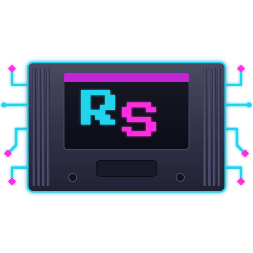
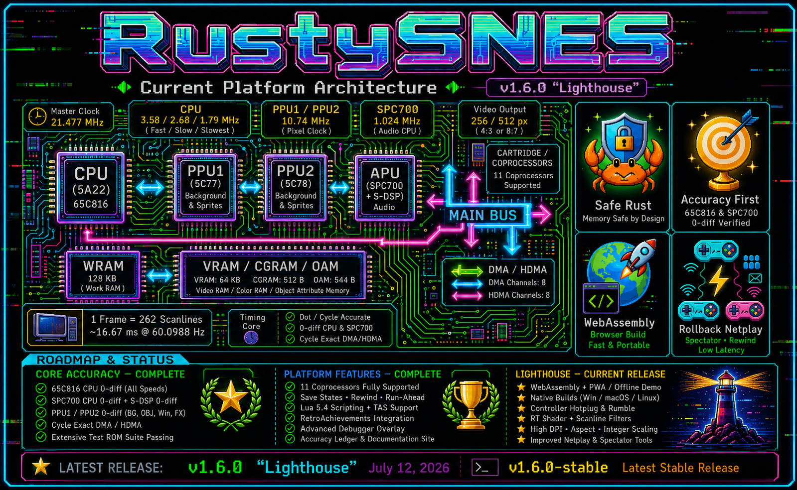
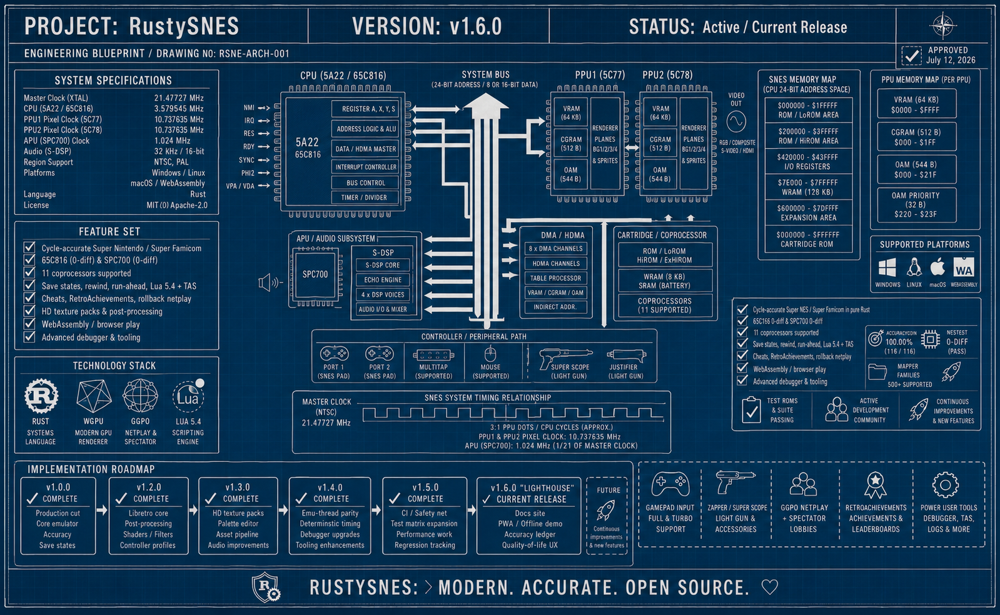
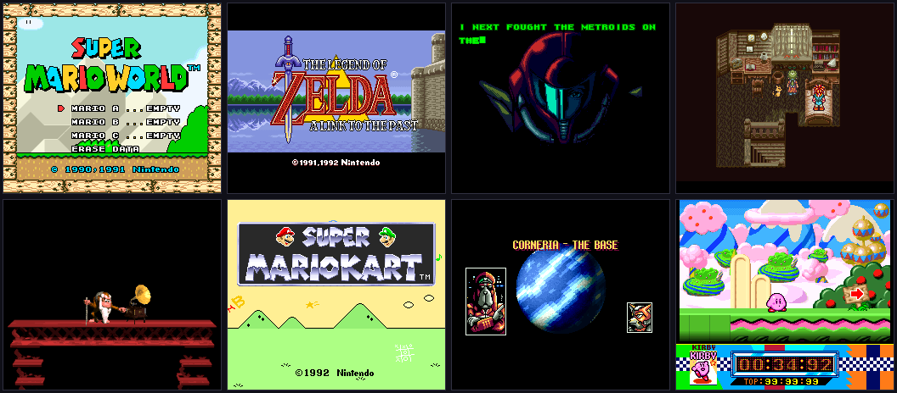
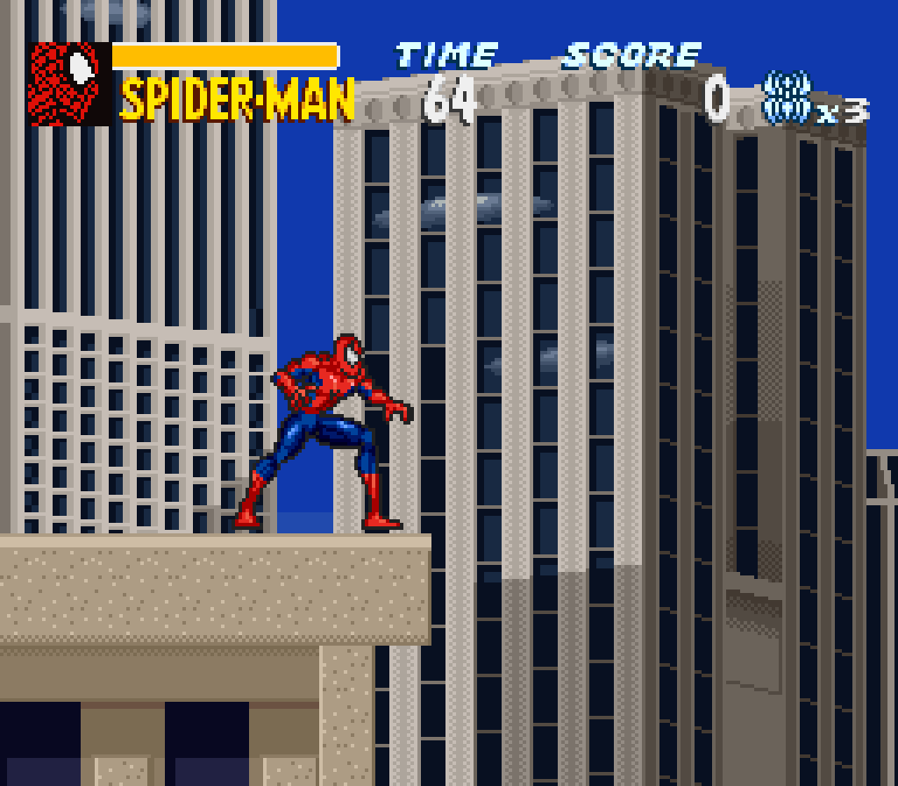
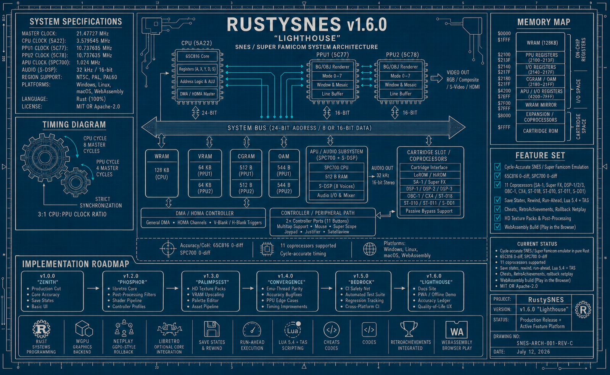
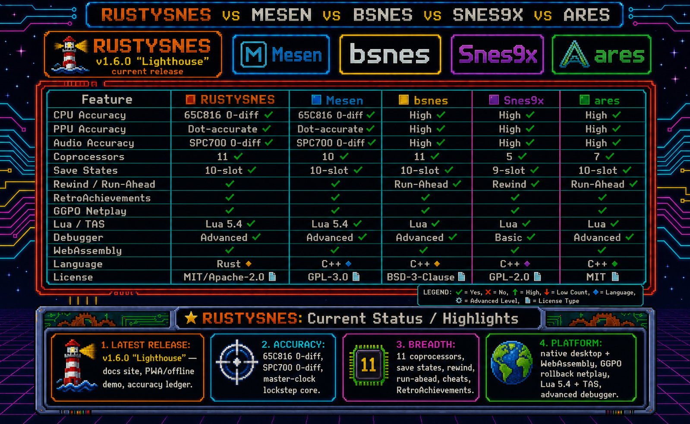
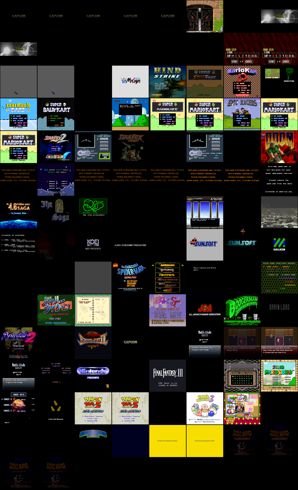

<!-- markdownlint-disable MD033 MD041 -->
<div align="center">

# RustySNES



> **Precise. Pure. Powerful.**

</div>

<p align="center">
  
</p>

<p align="center">
  <a href="https://github.com/doublegate/RustySNES/actions"></a> <a href="#license"></a> <a href="https://github.com/doublegate/RustySNES/releases"></a> <a href="rust-toolchain.toml"></a><br>
  <a href="#compatibility-and-accuracy"></a> <a href="#compatibility-and-accuracy"></a> <a href="https://doublegate.github.io/RustySNES/"></a><br>
  <a href="#platform-support"></a>
</p>

## Overview

**RustySNES is a cycle-accurate Super Nintendo Entertainment System (SNES) emulator written in
pure Rust.** Following the lineage of its predecessor
[`RustyNES`](https://github.com/doublegate/RustyNES), it targets the Mesen2 / higan / ares
accuracy bar — a master-clock lockstep scheduler, a strictly-owned bus, and a deterministic audio
resync model.

Beyond reference accuracy, RustySNES is a real, playable emulation platform today: a native
desktop shell (`winit` + `wgpu` + `cpal` + `egui`) boots real commercial ROMs with picture, sound,
and control, alongside **11 cartridge coprocessors**, save states with a thumbnail 10-slot
manager, rewind, run-ahead, a **Lua 5.4 scripting/TAS engine**, Game Genie / Pro Action Replay
cheats, **GGPO-style rollback netplay**, **RetroAchievements**, a growing multi-panel
**debugger**, and a live in-browser WebAssembly build. See
[`to-dos/VERSION-PLAN.md`](to-dos/VERSION-PLAN.md) for the named, versioned release ladder from
`v1.0.0 "Zenith"` (the production cut) onward.

**[Try it in your browser](https://doublegate.github.io/RustySNES/)** — no install required.

---

## Why RustySNES?

RustySNES combines **accuracy-first emulation** with the **safety guarantees of Rust**, and is
building toward the same modern-feature breadth as its sibling project
[`RustyNES`](https://github.com/doublegate/RustyNES), tracked in lockstep
([`to-dos/LOCKSTEP-CHECKLIST.md`](to-dos/LOCKSTEP-CHECKLIST.md)) rather than a one-time snapshot.

**Key differentiators:**

- **Reference-grade accuracy** — a from-scratch core on a 21.477 MHz NTSC master clock with a
  lockstep scheduler for every chip. The 5A22 CPU's variable-cycle (6/8/12) instruction timings
  and dot-accurate PPU/HDMA behavior are cycle-exact, not approximated: the 65C816 and SPC700 both
  clear their per-opcode SingleStepTests oracles at 0-diff.
- **Determinism as a hard contract** — the asynchronous SPC700/S-DSP audio processor is kept
  perfectly coherent with the main CPU through an integer relative-time accumulator, with no
  floating point in the timing path. The same seed, ROM, and input sequence yield a bit-identical
  framebuffer and audio output — the foundation save states, rewind, run-ahead, and rollback
  netplay all build on.
- **Honest accuracy tiering** — every coprocessor/board is tiered Core / Curated / BestEffort (see
  [`docs/adr/0003`](docs/adr/0003-accuracy-tiering-honesty-gate.md)); a CI honesty gate ensures no
  unverified BestEffort board ever backs the accuracy oracle. Nothing is silently degraded, and
  every known gap (a coprocessor boot issue, an unwired peripheral, an incomplete opt-in feature)
  is documented in [`docs/accuracy-ledger.md`](docs/accuracy-ledger.md) rather than hidden.
- **A CI safety net that actually gates merges** — `cargo test --workspace` and the full clippy
  matrix now run on every pull request that touches code (previously only on a tagged release),
  behind a single required `ci-success` check; the `no_std` build, the 3-OS test matrix, and the
  bench regression gate run on every push to `main`, every release tag, and a weekly cron
  (`docs/adr/0011`). A pure-docs PR (like this one) skips the code-only jobs entirely rather than
  spending CI minutes proving nothing changed.
- **Safe, modular Rust** — the chip stack is `no_std + alloc` with a one-directional workspace
  graph, making each component independently testable, fuzzable, and benchmarkable.

---

## Feature highlights

| Feature | Description |
| --- | --- |
| **Cycle-Accurate Core** | 65C816 + SPC700 both 0-diff vs. their SingleStepTests per-opcode oracles; a master-clock lockstep scheduler; dot-accurate PPU/HDMA/interrupts |
| **11 Coprocessors** | DSP-1, Super FX/GSU, SA-1 (Core/Curated, oracle-gated); DSP-2/4, ST010, CX4, OBC1, S-DD1 (BestEffort, real-title validated); ST018, S-RTC (BestEffort, unit-tested); SPC7110 (implemented — the local dump is a ROM-sourcing gap, not an open bug) |
| **Native Desktop Frontend** | `winit` + `wgpu` + `cpal` + `egui`; keyboard + gamepad input, drag-and-drop/zip-archived ROM loading, automatic coprocessor-firmware + `.srm` SRAM loading |
| **WebAssembly Build** | The SAME `App`/egui shell as native (`wasm-winit`), deployed live at the hosted demo, plus a lighter canvas-2D fallback (`wasm-canvas`), a PWA/offline service worker, and a `<5 MiB` gzip size-budget CI gate |
| **Save States** | A quick-save slot plus a disk-backed, thumbnail-previewed **10-slot manager**, keyed per-ROM by SHA-256, on a versioned deterministic snapshot envelope |
| **Rewind / Run-Ahead** | A bounded ring buffer of full snapshots + an N-frame peek-and-discard run-ahead, both config-driven and off by default |
| **Peripherals** | Mouse / Super Scope / Super Multitap — the real 2-bit-per-clock serial-shift-register protocol, ported from ares, not a stub |
| **Lua Scripting + TAS** | A sandboxed Lua 5.4 (`mlua`) engine with full-bus reads / WRAM writes + per-frame callbacks, and a deterministic TAS movie record/playback format |
| **Cheats** | Game Genie / Pro Action Replay codes, applied as a `Bus` read intercept (not a WRAM poke, since real codes target cartridge ROM) |
| **Rollback Netplay** | GGPO-style 2-player rollback over native UDP, proven bit-identical resimulation under adverse network conditions; a WebRTC transport exists at the crate level |
| **RetroAchievements** | A native FFI bridge around the vendored `rcheevos` `rc_client` C API — login, achievements, and unlock toasts |
| **Desktop UX Shell** | Light/dark/system themes, 25%-300% speed presets, fullscreen, a key-rebind grid, a Performance panel (FPS/frame-time/audio-health + a rolling sparkline), and a first-run welcome modal |
| **CRT / HQx Post-Filters** | A presentation-only post-filter pipeline (scanlines + aperture mask, an HQ2x-style edge-directed blend); the no-filter default stays byte-for-byte identical to the pre-filter blit |
| **HD Texture Packs** | A `pack.toml` loader + pure-Rust PNG decoder + CPU compositor, wired into the live `wgpu` present path at a fixed 2x upscale (`hd-pack`, off by default) |
| **7-Panel Debugger** | CPU / PPU / APU / Cart / Watch / Memory-Compare / Docs panels behind `debug-hooks`, extracted into a dedicated `debugger/` module — read/write watchpoints, a 65C816 disassembler + PC breakpoints/step controls, a live hex memory window, and an in-app glossary |
| **Libretro Core** | A real `rustysnes-libretro` core loadable by RetroArch — region-aware NTSC/PAL, cheats, coprocessor-firmware auto-resolution, peripheral negotiation, raw memory-map pointers |
| **Documentation Site** | A Material-for-MkDocs handbook at [`/docs/`](https://doublegate.github.io/RustySNES/docs/), alongside the playable demo (`/`) and rustdoc (`/api/`) on GitHub Pages |
| **Pure Rust** | `no_std + alloc` chip stack; a one-directional crate graph so each chip is independently fuzzable/benchmarkable |

Legend for the accuracy tiers: **Core/Curated** = cross-checked against an independent reference
oracle; **BestEffort, real-title validated** = boots a real commercial title to gameplay content;
**BestEffort, unit-tested** = no commercial dump in the local corpus yet. See
[`docs/STATUS.md`](docs/STATUS.md) for the always-current per-subsystem detail,
[`docs/accuracy-ledger.md`](docs/accuracy-ledger.md) for the disposition of every named residual,
and [`to-dos/VERSION-PLAN.md`](to-dos/VERSION-PLAN.md) for exactly which release each remaining
item lands in.

<p align="center">
  
</p>

---

## Showcase

A cross-section of the commercial library running pixel-accurately on RustySNES — Super Mario
World, *The Legend of Zelda: A Link to the Past*, Super Metroid, and Chrono Trigger on the base
LoROM/HiROM path; Donkey Kong Country's pre-rendered ACM art; Super Mario Kart on the DSP-1 math
coprocessor; Star Fox's Corneria intro rendered live by the Super FX/GSU core; and Kirby Super
Star on SA-1.

<p align="center">
  
</p>

The full per-coprocessor visual corpus lives in
[`screenshots/external/commercial/`](screenshots/external/commercial/) — boot / title / gameplay
frames spanning every LoROM/HiROM × coprocessor combination in the local ROM corpus, generated by
[`scripts/screenshots/generate.sh`](scripts/screenshots/generate.sh) (see
[`screenshots/README.md`](screenshots/README.md)).

---

## Features

### Emulation core

- **Master-clock-precise scheduler.** A 21.477 MHz NTSC master clock drives the CPU, PPU, and APU
  in lockstep — every chip advances off the same tick count, so mid-instruction PPU/HDMA events
  (a mid-scanline scroll write, an HDMA-driven register update visible only starting the following
  line) work without per-quirk patches.
- **Cycle-accurate WDC 65C816 (Ricoh 5A22)** — all opcodes and addressing modes, native and
  emulation mode, variable 6/8/12-cycle bus access timing, `REP`/`SEP`/`XCE`, and cycle-exact
  interrupt/DMA timing — 0-diff (state + cycles) against the SingleStepTests/65816 oracle
  (5,119,999 / 5,120,000; the one residual is a documented inter-reference divergence, not a bug —
  [`docs/adr/0002`](docs/adr/0002-fractional-timebase-refactor.md)).
- **Cycle-accurate PPU1 (5C77) + PPU2 (5C78)** — BG modes 0-7, Mode 7 affine transforms, the full
  128-sprite OAM pipeline, color math, windows, and a per-scanline compositor that renders each
  line one dot before that line's own HDMA can mutate the registers it reads, matching real
  hardware's mid-scanline register-visibility timing.
- **Cycle-accurate SPC700 + S-DSP** — the SMP advances in cycle-exact sub-instruction lockstep
  with the main CPU via an integer relative-time accumulator (no floating point in the timing
  path), and the S-DSP is itself cycle-stepped (32 ticks per 32 kHz sample) so a mid-instruction
  DSP-register read sees cycle-correct envelope state. 0-diff against the SingleStepTests/spc700
  oracle (256,000 / 256,000) and a literal `PASSED TESTS` verdict on all four blargg `spc_*` ROMs.

### Cartridges and coprocessors

- **LoROM / HiROM / ExHiROM** memory-map decode with score-based header detection, plus an
  unofficial ExLoROM decode path (bsnes-sourced, no real-ROM validation yet).
- **11 cartridge coprocessors** — one board/family per row of
  [`docs/STATUS.md`](docs/STATUS.md)'s coprocessor tier matrix (DSP-2 and DSP-4 share one row and
  one count, as do ST010 and ST011), each honestly tiered (Core / Curated / BestEffort —
  [`docs/adr/0003`](docs/adr/0003-accuracy-tiering-honesty-gate.md)):
  - **Core/Curated (oracle-gated):** DSP-1/1A/1B (a full µPD7725 LLE engine, shared by six DSP
    variants), Super FX / GSU-1/2 (a full Argonaut RISC core), SA-1 (a real second 65C816
    instantiated and stepped in lockstep with the main CPU).
  - **BestEffort, real-title validated:** DSP-2/4 (the shared DSP LLE engine retargeted per
    variant — validated against real Dungeon Master and Top Gear 3000 respectively), ST010 (the
    same shared engine, validated against real F1 ROC II; ST011 shares the row but has no
    confirmed real-title detection entry yet), S-DD1 (a Golomb-code decompressor streamed during
    DMA), CX4 (a clean-room HG51B169 core), and OBC1.
  - **BestEffort, unit-tested:** ST018 (a full ARMv3 core), S-RTC — no commercial dump in the
    local corpus yet.
  - **SPC7110** is fully implemented (DCU/ALU/data-port + a paired Epson RTC-4513), but the one
    locally available dump turned out to be a fan-translation ROM hack, not an original
    cartridge — a documented ROM-sourcing gap, not an open bug
    ([`docs/rom-test-corpus.md`](docs/rom-test-corpus.md)).
- See [`docs/cart.md`](docs/cart.md) for the full coprocessor implementation detail and
  [`docs/STATUS.md`](docs/STATUS.md) for the always-current per-suite pass counts.

### Modern features

- **RetroAchievements** *(opt-in `retroachievements` feature, native-only)* — a native FFI bridge
  around the vendored `rcheevos` `rc_client` C API: login, achievements, and unlock toasts.
- **Rollback netplay** *(opt-in `netplay` feature)* — GGPO-style 2-player rollback over native
  UDP, proven bit-identical resimulation under adverse network conditions (latency, jitter, packet
  loss); a WebRTC transport exists at the crate level.
- **Lua 5.4 scripting + TAS** *(opt-in `scripting` feature, native-only)* — a sandboxed `mlua`
  engine (`io`/`os`/`require`/`debug` denied, a runaway-loop instruction budget) reads the full
  24-bit bus and writes WRAM through `emu.read`/`emu.write`, plus per-frame callbacks; a
  deterministic `rustysnes_core::movie` TAS format records/replays input logs bit-identically
  against a committed ROM. See [`docs/frontend.md`](docs/frontend.md) §Scripting.
- **Cheats** *(opt-in `cheats` feature)* — Game Genie and Pro Action Replay code decoding, applied
  as a `Bus` read intercept rather than a WRAM poke, since real codes overwhelmingly target
  cartridge ROM.
- **Save states, rewind, and run-ahead** — a quick-save slot plus a disk-backed, thumbnail-previewed
  10-slot manager on a versioned deterministic snapshot envelope (`docs/adr/0006`); a bounded
  rewind ring buffer and an N-frame run-ahead, both config-driven and off by default.
- **CRT / HQx post-filters** — a presentation-only pipeline (Settings → Video / View →
  Post-filter): scanlines + an aperture mask, and an HQ2x-style edge-directed upscale blend. The
  no-filter default (`PostFilter::None`) stays byte-for-byte identical to the pre-filter direct
  blit.
- **HD texture packs** *(opt-in `hd-pack` feature, off by default)* — a palette-inclusive
  allocation-free tile-identity hash computed in `rustysnes-ppu`, a `pack.toml` loader + pure-Rust
  PNG decoder, and a CPU compositor wired into the live `wgpu` present path at a fixed 2x upscale.
  See [`docs/adr/0010`](docs/adr/0010-hd-texture-pack-system.md).
- **Peripherals** — Mouse, Super Scope, and Super Multitap, implemented as the real 2-bit-per-clock
  serial-shift-register protocol (ported from ares), including WRIO IOBIT plumbing and the Super
  Scope's PPU H/V-counter beam latch — not stubs.
- **Libretro core** — `rustysnes-libretro` wraps the same deterministic core as a RetroArch-loadable
  shared library: region-aware NTSC/PAL geometry + timing, cheat support, coprocessor-firmware
  auto-resolution, Mouse/Super Scope/Multitap peripheral negotiation, and raw WRAM/VRAM/SRAM
  memory-map pointers. See [`docs/libretro.md`](docs/libretro.md).

### Debugger and tooling *(`debug-hooks`, extracted `v1.7.0`-`v1.8.0`)*

The debugger overlay was extracted from an inline block in `ui_shell.rs` into its own
`debugger/` module (`v1.7.0 "Telemetry"`) and deepened with a second rung of panels
(`v1.8.0 "Tracepoint"`), all read-only and determinism-preserving:

- **CPU / PPU / APU / Cart panels** — live register state, a 65C816 disassembler with PC
  breakpoints and step controls, per-scanline PPU state, and per-voice S-DSP state.
- **Watch panel** — read/write watchpoints plus a live 512-byte hex memory window (via
  `Bus::peek`, the same non-intrusive read the disassembler uses; I/O register space reads back as
  `00` rather than a live register value, since `Bus::peek` deliberately doesn't model registers).
- **Memory Compare panel** *(`v1.8.0`)* — captures a baseline of the Memory panel's current window
  and diffs it against the live window every frame, showing only the rows that changed.
- **Docs panel** *(`v1.8.0`)* — an in-app SNES-terminology glossary
  ([`docs/glossary.md`](docs/glossary.md), embedded at compile time) plus a link to the full
  MkDocs handbook.

Write-capable hex editing, RAM search, a call-stack view, an instruction/event trace buffer, an
inline 65816 assembler, and per-coprocessor-type register panels are honestly scoped as follow-up
work, not silently dropped — see [`CHANGELOG.md`](CHANGELOG.md)'s `v1.7.0`/`v1.8.0` entries and
[`to-dos/VERSION-PLAN.md`](to-dos/VERSION-PLAN.md).

### CI, docs, and web *(`v1.5.0`-`v1.6.0`)*

- **A CI safety net that actually gates merges** *(`v1.5.0 "Bedrock"`)* — `cargo test --workspace`
  now runs on every PR (a `test-light` job), not just tagged releases; a `changes`/`setup` job pair
  computes a light-vs-full run mode per push, and the full clippy matrix / `no_std` build / bench
  gate now also run on every push to `main`, plus a weekly drift-net cron. A single `ci-success`
  job is the required branch-protection check. See [`docs/adr/0011`](docs/adr/0011-branch-protection-and-ci-success-gate.md).
- **Documentation site + PWA** *(`v1.6.0 "Lighthouse"`)* — a Material-for-MkDocs handbook at
  [`/docs/`](https://doublegate.github.io/RustySNES/docs/), alongside the wasm demo (`/`) and
  rustdoc (`/api/`), served by a single `web.yml` workflow that also enforces the `<5 MiB` gzip
  wasm size budget on every PR. The wasm demo gained PWA/offline support (a web manifest, a
  stale-while-revalidate service worker).
- **`docs/accuracy-ledger.md`** *(`v1.6.0`)* — every known approximation or divergence mapped to an
  explicit disposition (Remediated / No-stricter-oracle-available / Deferred / Out-of-scope), the
  "why" companion to `docs/STATUS.md`'s pass-count dashboard.

<p align="center">
  
</p>

<p align="center"><sub>The Amazing Spider-Man: Lethal Foes — multi-layer BG parallax, sprite
compositing, and HUD overlay, all dot-accurate output straight from the cycle-accurate PPU
pipeline every title runs through.</sub></p>

---

## Crates & Architecture

The workspace strictly enforces a one-directional dependency graph to isolate emulation systems
from one another, connected only through the core bus.

| Crate | Role |
| --- | --- |
| `rustysnes-cpu` | WDC 65C816 (Ricoh 5A22) |
| `rustysnes-ppu` | PPU1 (5C77) + PPU2 (5C78) |
| `rustysnes-apu` | SPC700 + S-DSP |
| `rustysnes-cart` | LoROM/HiROM/ExHiROM + all 11 coprocessor implementations |
| `rustysnes-core` | The Bus + master-clock scheduler tie crate, including peripherals (mouse/scope/multitap) |
| `rustysnes-savestate` | The versioned save-state envelope shared by every board + chip |
| `rustysnes-frontend` | The `winit + wgpu + cpal + egui` desktop/web shell (binary `rustysnes`), including the `debugger/` module |
| `rustysnes-netplay` | GGPO-style rollback netcode (native UDP + a WebRTC transport) |
| `rustysnes-cheevos` | RetroAchievements `rcheevos` FFI bridge (opt-in, native-only) |
| `rustysnes-script` | Sandboxed Lua 5.4 scripting engine + TAS movie format (opt-in, native-only) |
| `rustysnes-libretro` | Native Libretro API core wrapper (RetroArch) |
| `rustysnes-test-harness` | The accuracy oracle (SingleStepTests runners, golden-log suites, per-coprocessor commercial-ROM validation, boot-screenshot generation) |

Three load-bearing architectural decisions, detailed in
[`docs/architecture.md`](docs/architecture.md):

1. **A shared master-clock timebase.** Every chip advances off the same 21.477 MHz master clock
   in lockstep, so mid-instruction PPU/HDMA events work without per-quirk patches.
2. **The Bus owns everything mutable.** `rustysnes-core::Bus` holds the PPU, APU, cart, and
   controller state; the CPU borrows `&mut Bus` during execution.
3. **A one-directional workspace graph.** No chip crate depends on another; `rustysnes-core` ties
   them together, so each chip is independently fuzzable and benchmarkable.

<p align="center">
  
</p>

See [`docs/DOCUMENTATION_INDEX.md`](docs/DOCUMENTATION_INDEX.md) for the full documentation map
(subsystem specs, ADRs, testing strategy, and more).

### Project layout

```text
crates/        Cargo workspace: the crates above
docs/          Implementation specs, ADRs, the MkDocs handbook source, and STATUS.md
                (single source of truth)
ref-docs/      Immutable deep-research SNES hardware reference
ref-proj/      Study clones of reference emulators (gitignored; bsnes/ares/Mesen2)
tests/roms/    Committed permissive corpus + gitignored external/ (commercial dumps +
                coprocessor firmware — never committed, ADR 0003)
screenshots/   Committed boot-screenshot corpus + curated showcase/montage images
scripts/       Screenshot generation, wasm size-budget gate, bench regression check
to-dos/        The roadmap (ROADMAP.md) and the named, versioned release ladder
                (VERSION-PLAN.md)
```

---

## Quick Start

### Build from source

**Prerequisites:**

- **Rust 1.96** — pinned via `rust-toolchain.toml` and auto-installed by
  [rustup](https://rustup.rs).
- **Linux desktop dependencies** for `winit` / `wgpu` / `cpal` / `egui` (see below).
- **Git.**

```bash
# Clone the repository
git clone https://github.com/doublegate/RustySNES.git
cd RustySNES

# Build the workspace (release)
cargo build --release --workspace

# Run a ROM you legally own
cargo run --release -p rustysnes-frontend -- path/to/rom.sfc

# Optional: build with one feature (e.g. RetroAchievements)
cargo run --release -p rustysnes-frontend --features retroachievements -- path/to/rom.sfc

# Maximal NATIVE build — every opt-in feature at once (debug-hooks, scripting,
# cheats, netplay, retroachievements, hd-pack). Aliases make it a one-liner:
cargo full-run path/to/rom.sfc   # run the most fully-featured desktop binary
cargo full-build                 # build it (= --release -p rustysnes-frontend --features full)
```

The `full` build is purely additive — the default/shipped build and the emulation core are
unchanged. `emu-thread` (a dedicated emulation thread) is deliberately excluded from `full`: it
isn't feature-complete yet (movies, Lua scripting, RetroAchievements, and rewind-recording remain
unported — see `docs/frontend.md`).

The frontend opens a window (scaled, aspect-correct), starts audio via the OS default device, and
runs the ROM. With no ROM path, it opens straight to the menu shell (File → Open ROM…).

#### Command-line help

The native binary ships a clap 4 CLI with styled `--help`, a `help` subcommand, shell completions,
and (on a terminal) an interactive help browser:

```bash
rustysnes --help                 # styled usage + examples + keyboard summary
rustysnes help                   # browse all topics (interactive TUI on a terminal)
rustysnes help coprocessors      # one topic, printed (also works piped: `… | less`)
rustysnes completions fish       # print a shell-completion script
```

Help topics: `controls`, `hotkeys`, `gamepad`, `features`, `coprocessors`, `config`, `scripting`,
`netplay`, `about`. The interactive browser is behind the default-on `help-tui` cargo feature;
piped/non-terminal output falls back to a static page.

### Platform-specific dependencies

**Ubuntu / Debian:**

```bash
sudo apt-get install -y libxkbcommon-dev libwayland-dev libxkbcommon-x11-dev libasound2-dev libudev-dev
```

**CachyOS / Arch:**

```bash
sudo pacman -S --needed libxkbcommon wayland alsa-lib systemd-libs
```

**macOS / Windows:** no extra system dependencies are required for the default build. The
optional `retroachievements` and `scripting` features additionally need a C compiler for their
vendored C sources (`rcheevos`, `mlua`'s Lua 5.4).

### Run in the browser (WebAssembly)

A hosted demo is deployed automatically on every push to `main`, live at
**[doublegate.github.io/RustySNES](https://doublegate.github.io/RustySNES/)**, alongside a
PWA/offline-capable service worker and a `<5 MiB` gzip size budget enforced in CI. To build it
yourself you need [trunk](https://trunkrs.dev) (`cargo install trunk`):

```bash
cd crates/rustysnes-frontend/web
trunk serve            # dev server
trunk build --release  # the full winit + wgpu + egui build in ./dist
# Or a lightweight canvas-2D embed:
trunk build --release --no-default-features --features wasm-canvas
```

---

## Desktop UX

The desktop frontend frames the SNES image with an always-on **menu bar** (top) and **status
bar** (bottom); the egui debugger is a separate overlay (behind the `debug-hooks` feature).
Everything is reachable from the menu bar, and also from **global keyboard hotkeys** (`v1.0.1`):
`Escape`=Quit, `F1`=Save State, `F2`=Reset, `F3`=Power Cycle, `F4`=Load State, `F5`=Rewind,
`F9`=Save States… window, `F11`=Fullscreen, `F12`=Open ROM, `Space`=Pause/Resume, `` ` ``=Toggle
Debugger overlay (feature-gated: `debug-hooks`) — see `rustysnes help hotkeys`.

- **Menu bar** — File (Open ROM, Close ROM, Settings, Quit), Emulation (Pause/Resume, Reset, Power
  Cycle, Save/Load State (quick slot), Rewind, **Save States…** (10-slot thumbnail manager),
  Region, **Speed** 25%–300% presets, Window Size 1x–4x presets), Tools (Cheats / Netplay /
  RetroAchievements windows, each feature-gated), View (Integer scale, **Post-filter** (CRT /
  HQx), **Performance panel**, **Fullscreen**), Debug (the 7-panel debugger overlay,
  feature-gated).
- **Settings window** — a tabbed Video / Audio / Input / System dialog: present-mode radio,
  volume slider, **8 per-voice mute checkboxes** (`v1.0.1`, a frontend/debug convenience — real
  S-DSP hardware has no per-voice mute register), a per-button **key-rebind grid** (click "Rebind",
  press the new key — Esc cancels), controller port 2 peripheral selection, region, HD texture
  pack selector, and **light/dark/system theme**.
- **Performance panel** — FPS, current speed, frame time, audio-ring health, and a rolling
  ~2-second frame-time sparkline — pure diagnostics, no controls.
- **First-run welcome modal** — a brief orientation shown once, the very first launch.

## Default Controls

Every P1 binding is rebindable in Settings → Input (persisted to `config.toml`). USB gamepads
auto-bind to P1 (Xbox-style: South = B, East = A, West = Y, North = X — the SNES diamond is
rotated relative to Xbox's).

| Action | Key |
| --- | --- |
| D-pad | Arrow keys |
| A / B | X / Z |
| X / Y | S / A |
| L / R | Q / W |
| Select / Start | Right Shift / Enter |

Run `rustysnes help controls` / `help gamepad` for the full reference.

---

## Compatibility and Accuracy

RustySNES doesn't have one monolithic all-in-one oracle ROM (the way RustyNES's AccuracyCoin
does for the NES) — no publicly available SNES ROM plays that role. Instead, accuracy is a
**composed multi-layer battery** across independently-sourced suites
([`docs/testing-strategy.md`](docs/testing-strategy.md)); each layer's own status is tracked
here, always current, reaffirmed every release:

| Layer | Result |
| --- | --- |
| CPU (65C816) per-opcode oracle | **0-diff** — 5,119,999 / 5,120,000 (the one residual is a documented inter-reference divergence, not a bug — [`docs/adr/0002`](docs/adr/0002-fractional-timebase-refactor.md)) |
| SPC700 per-opcode oracle | **0-diff, 100.00%** — 256,000 / 256,000 |
| On-cart CPU (gilyon `cputest-basic`) | **green** — 1107 / 1107 "Success" |
| PPU/DMA/HDMA golden framebuffer (undisbeliever) | **green, deterministic** — 29 / 29 ROMs bit-identical |
| Audio boot+run (blargg `spc_*`) | **literal PASS, all 4** — `spc_smp`, `spc_timer`, `spc_mem_access_times`, `spc_dsp6` |
| Core/Curated coprocessors (oracle-gated) | **3 / 3, honesty gate green** — DSP-1, Super FX/GSU, SA-1 |
| BestEffort coprocessors, real-title validated | **6 / 9** — DSP-2, DSP-4, ST010, S-DD1, CX4, OBC1 |
| BestEffort coprocessors, unit-test only | **3 / 9** — SPC7110 (ROM-sourcing gap, not a bug), ST018, S-RTC |
| Determinism contract | **proven** — bit-identical framebuffer/audio across runs; save-state round-trip proven across all three board tiers |

**Named residuals, tracked not hidden:** the 65816 `e1.e` inter-reference divergence; DSP-3 and
ST011 have no board wired yet; SPC7110's one locally available dump turned out to be a
fan-translation ROM hack, not an original cartridge (a correctly-sourced dump is the actual
remaining gap); PAL and ExLoROM both lack golden-ROM-boot proof (no ROM in the local corpus for
either); hi-res (Modes 5/6) output is implemented and unit-verified but has no real-title
validation yet. The full per-suite breakdown and the coprocessor coverage matrix live in
**[`docs/STATUS.md`](docs/STATUS.md)**; the disposition of every one of these residuals
(Remediated / No-stricter-oracle-available / Deferred / Out-of-scope) is tracked in
**[`docs/accuracy-ledger.md`](docs/accuracy-ledger.md)**.

**Everything shipped is additive and off-by-default** — every optional feature (`debug-hooks`,
`scripting`, `cheats`, `netplay`, `retroachievements`, `hd-pack`, `emu-thread`) is a frontend tap
or opt-in flag, so the default/native/`no_std`/wasm builds stay byte-identical when off.

> A note on test counts: RustySNES is validated by closed-form oracle ROMs (SingleStepTests,
> gilyon, undisbeliever, blargg) and per-coprocessor commercial-ROM suites, not by a headline unit
> test number alone (unit/integration tests run in `cargo test --workspace`, separate from the
> oracle suites above, which need `--features test-roms`). When a doc and a passing test ROM
> disagree, **the ROM wins** — that is this project's definition of "cycle-accurate."

<p align="center">
  
</p>

<p align="center"><sub>An illustrative capability comparison against established SNES emulators —
authoritative, always-current pass counts live in <a href="docs/STATUS.md">docs/STATUS.md</a>,
not this diagram.</sub></p>

---

## Performance

The headless core is comfortably real-time. Against the **16.64 ms NTSC frame deadline**:

| Workload | Frame time | Headroom |
| --- | --- | --- |
| `headless_frame_steady_state` (no-coprocessor ROM) | 3.27 ms | ~5.1× realtime |

A CI frame-time regression gate (`.github/workflows/ci.yml`'s `bench` job,
[`scripts/bench_regression_check.sh`](scripts/bench_regression_check.sh)) runs this benchmark on
every release-tag push and fails on a gross (~3×) regression against a 10 ms absolute ceiling — a
deliberately non-flaky gate, not a tight percentage check (shared CI runners are too noisy for
that). The reproducible record (methodology, all benches, and save-state cost) is in
[`docs/benchmarks.md`](docs/benchmarks.md).

---

## Platform Support

| Platform | Status |
| --- | --- |
| **Windows x64** | Primary (release binary) |
| **Linux x64** | Primary (release binary) |
| **macOS ARM64** | Primary (release binary; Apple silicon) |
| **WebAssembly** | Primary (hosted demo + PWA/offline, deployed on every push to `main`) |
| **Libretro Core** | Supported (RetroArch via `rustysnes-libretro`) |

### System requirements

- **Rust 1.96 stable** (pinned via `rust-toolchain.toml`; auto-installed by `rustup`).
- A GPU with a `wgpu`-supported backend (Vulkan / Metal / DX12, or WebGL2 in the browser).
- The optional `retroachievements` / `scripting` features need a C compiler for their vendored C
  sources; the default build does not.

---

## Documentation

| Document | Description |
| --- | --- |
| [Project status matrix](docs/STATUS.md) | Per-suite pass count, coprocessor coverage, feature flags, version policy — the single source of truth |
| [Accuracy ledger](docs/accuracy-ledger.md) | Every known approximation/divergence mapped to an explicit disposition |
| [Architecture](docs/architecture.md) | System design and the load-bearing decisions |
| [Frontend](docs/frontend.md) | The desktop/wasm shell, save states, pacing, the debugger overlay, scripting, netplay, RetroAchievements |
| [Libretro core](docs/libretro.md) | `rustysnes-libretro`, a RetroArch-loadable core — build steps, manual verification, known scope cuts |
| [CHANGELOG.md](CHANGELOG.md) | Version history and release notes |
| [Documentation handbook](https://doublegate.github.io/RustySNES/docs/) | The Material-for-MkDocs site rendering the subsystem specs (also on GitHub Pages) |
| [Roadmap](to-dos/ROADMAP.md) | The forward roadmap — the phase spine |
| [Version plan](to-dos/VERSION-PLAN.md) | The named, versioned release ladder to `v1.0.0` and beyond |
| [Lockstep checklist](to-dos/LOCKSTEP-CHECKLIST.md) | The process for tracking RustyNES's own continuing development before scoping each release |

### Hardware and subsystem specs

| Component | Location |
| --- | --- |
| CPU (65C816) | [docs/cpu.md](docs/cpu.md) |
| PPU (5C77/5C78) | [docs/ppu.md](docs/ppu.md) |
| APU (SPC700/S-DSP) | [docs/apu.md](docs/apu.md) |
| Cartridges / coprocessors | [docs/cart.md](docs/cart.md) |
| Testing strategy | [docs/testing-strategy.md](docs/testing-strategy.md) |

Architecture Decision Records live in [`docs/adr/`](docs/adr/). Deep hardware reference research
lives in [`ref-docs/`](ref-docs/) (immutable). The full documentation map is
[`docs/DOCUMENTATION_INDEX.md`](docs/DOCUMENTATION_INDEX.md).

The hosted GitHub Pages deployment serves **three** sections from one artifact: the playable
WebAssembly demo at
**[doublegate.github.io/RustySNES](https://doublegate.github.io/RustySNES/)**, the workspace API
docs (rustdoc) at
**[doublegate.github.io/RustySNES/api/](https://doublegate.github.io/RustySNES/api/)**, and the
Material-for-MkDocs documentation handbook at
**[doublegate.github.io/RustySNES/docs/](https://doublegate.github.io/RustySNES/docs/)**.

---

## Current Release

RustySNES's current release is **v1.8.0 "Tracepoint"**. See [`docs/STATUS.md`](docs/STATUS.md)
and [`CHANGELOG.md`](CHANGELOG.md) for the full release history (`v0.1.0` through `v1.8.0`) and
per-release detail.

- **Download:** the [GitHub Releases](https://github.com/doublegate/RustySNES/releases) page —
  desktop binaries for Linux, macOS (aarch64), and Windows.
- **Full per-version history:** [`CHANGELOG.md`](CHANGELOG.md).
- **Authoritative current state:** [`docs/STATUS.md`](docs/STATUS.md).

## Roadmap

`v1.0.0` — the production cut — shipped 2026-07-10, followed by `v1.0.1` (per-voice audio mutes,
global keyboard hotkeys), `v1.1.0` (a research + accuracy pass), `v1.2.0` (the Libretro core +
CRT/HQx post-filters), `v1.3.0` (HD texture packs), and `v1.4.0 "Convergence"` (the
`emu-thread`-parity + accuracy-bugfix release that closed the post-`v1.3.0` patch cluster).

Starting at `v1.5.0`, RustySNES entered the **RustyNES-parity ladder**: a multi-release plan to
close the gap between this project's own feature/UX/accuracy maturity and its sibling NES
emulator, tracked in lockstep rather than a frozen snapshot
([`to-dos/LOCKSTEP-CHECKLIST.md`](to-dos/LOCKSTEP-CHECKLIST.md)):

- **`v1.5.0 "Bedrock"`** — the CI safety net: `cargo test --workspace` now runs on every PR, not
  just tagged releases, behind a single required `ci-success` check.
- **`v1.6.0 "Lighthouse"`** — a Material-for-MkDocs documentation handbook, PWA/offline support
  for the wasm demo, and `docs/accuracy-ledger.md`.
- **`v1.7.0 "Telemetry"`** — the debugger overlay extracted into a dedicated `debugger/` module,
  plus a live hex Memory panel.
- **`v1.7.1`** — a patch release fixing two user-reported production bugs: the GitHub Pages Help
  menu under-reporting the running version (a `Cargo.toml` version-bump ceremony gap since
  `v1.5.0`), and the wasm demo's canvas rendering at a fixed, undersized 2x scale instead of the
  native 3x default.
- **`v1.8.0 "Tracepoint"`** — debugger depth II: a Memory Compare panel and an in-app Docs/glossary
  panel.

The full roadmap lives in [`to-dos/ROADMAP.md`](to-dos/ROADMAP.md) (the phase spine) and
[`to-dos/VERSION-PLAN.md`](to-dos/VERSION-PLAN.md) (the named release ladder, including the
in-progress and planned rungs through the parity target).

---

<p align="center">
  
</p>

## Contributing

Contributions of all kinds are welcome — code, testing, documentation, and design. Please read
[`CONTRIBUTING.md`](CONTRIBUTING.md) for the quality-gate contract, the conventional-commit
format, and the chip-behavior-change rule (a chip change touches both the code and its
`docs/<subsystem>.md` in the same PR).

### Quick contribution workflow

```bash
# 1. Fork and clone, then create a feature branch
git checkout -b feat/my-feature

# 2. Make changes and run the quality gates
cargo test --workspace
cargo clippy --workspace --all-targets -- -D warnings
cargo fmt --all --check

# 3. Commit using conventional commits, then push and open a PR
git commit -m "feat(cart): implement <thing>"
git push origin feat/my-feature
```

The quality gates (`fmt`, `clippy`, `doc`, and the test suite) run in CI on every PR that touches
code (`v1.5.0`'s CI safety net) and must be green; a pure-docs change skips them by design — see
[`docs/adr/0011`](docs/adr/0011-branch-protection-and-ci-success-gate.md).

---

## License

RustySNES is dual-licensed under your choice of:

- **[MIT License](LICENSE-MIT)** — permissive, allows commercial use.
- **[Apache License 2.0](LICENSE-APACHE)** — permissive with a patent grant.

Unless you state otherwise, any contribution you submit is dual-licensed as above.

**Test ROMs** under `tests/roms/` are individually CC0, MIT, or Zlib licensed. **No commercial
Nintendo ROMs are included, and they will never be bundled** — dumps used for coprocessor
validation are the user's responsibility and must come from cartridges they legally own
([`docs/adr/0003`](docs/adr/0003-accuracy-tiering-honesty-gate.md)).

---

## Acknowledgments

RustySNES stands on the shoulders of giants:

- The **[SNESdev wiki](https://snes.nesdev.org/wiki/)** and **[Nesdev wiki](https://www.nesdev.org/wiki/)**
  communities for decades of hardware documentation and forum research.
- **[Mesen2](https://github.com/SourMesen/Mesen2)**, **[higan](https://github.com/higan-emu/higan)**,
  and **[ares](https://github.com/ares-emulator/ares)** as the accuracy reference bar and trace
  oracles.
- **[RustyNES](https://github.com/doublegate/RustyNES)**, this project's own predecessor, for the
  Bus-owns-everything architecture, the frontend shell, the `cargo full-build`/CLI conventions,
  and the CI/docs-site infrastructure pattern ported here.
- **[SingleStepTests](https://github.com/SingleStepTests/65816)** for the closed-form 65C816/SPC700
  per-opcode oracle.
- **[undisbeliever](https://github.com/undisbeliever)** and **[gilyon](https://github.com/gilyon)**
  for the PPU/DMA/HDMA and on-cart CPU test-ROM suites.
- **[RetroAchievements](https://retroachievements.org/)** and the
  **[`rcheevos`](https://github.com/RetroAchievements/rcheevos)** library that powers the
  achievement integration.

---

## Citation

If you use RustySNES in academic research, please cite:

```bibtex
@software{rustysnes2026,
  author  = {RustySNES Contributors},
  title   = {RustySNES: A Cycle-Accurate SNES Emulator in Rust},
  year    = {2026},
  version = {1.8.0},
  url     = {https://github.com/doublegate/RustySNES},
  note    = {Cycle-accurate SNES/Super Famicom emulator on a master-clock-precise scheduler;
             65C816 and SPC700 both 0-diff against SingleStepTests; 11 cartridge coprocessors
             (DSP-1, Super FX/GSU, SA-1, DSP-2/4, ST010, S-DD1, CX4, OBC1, SPC7110, ST018,
             S-RTC), save states with rewind/run-ahead, Lua 5.4 scripting with a deterministic
             TAS format, GGPO-style rollback netplay, RetroAchievements, and a multi-panel
             debugger; pure-Rust winit/wgpu/cpal/egui frontend with a WebAssembly build}
}
```

---

<p align="center">
  <strong>Built with Rust. Powered by passion for retro gaming.</strong><br>
  <sub>Preserving video game history, one frame at a time.</sub>
</p>

<p align="center">
  <a href="#quick-start">Get Started</a> ·
  <a href="https://doublegate.github.io/RustySNES/">Play in Browser</a> ·
  <a href="CONTRIBUTING.md">Contribute</a> ·
  <a href="docs/">Documentation</a>
</p>
